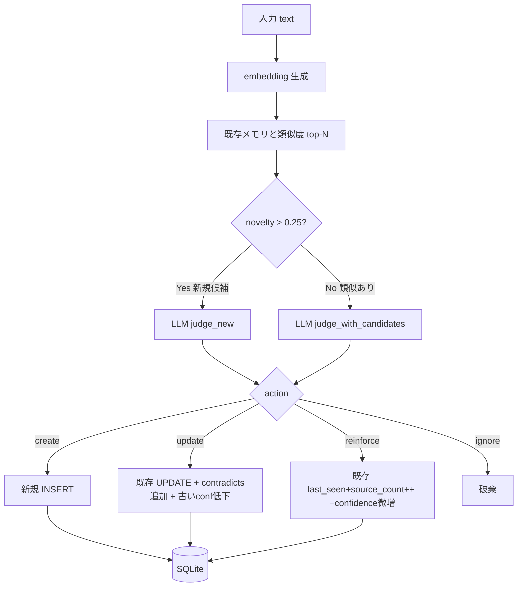

<div align="center">

# diff-memory

### ローカルLLMで「新規性のある情報だけ」を残す差分メモリ層

[](#インストール)
[](diff_memory/db.py)
[](#インストール)
[](LICENSE)

**同じ話を繰り返しても1件にまとまる。矛盾は履歴で残る。判定はあなたのローカルLLMが下す。**

---

</div>

## 概要

通常のRAG（全文保存）ではなく、入力ごとに「新規か / 既存を更新か / 同じ繰り返しで補強か / 無視か」をローカルLLMに判定させ、本当に意味がある情報だけを SQLite に蓄積するメモリ層。

「同じ話の繰り返し」「過去発言の更新・矛盾」「保存価値のない雑談」を分けて扱うため、長期運用しても記憶が雪だるま式に増えず、検索時に古い情報と新情報が並んで返る事故も起きにくい。

完全ローカル動作、依存4個、SQLite 1ファイル運用。

## 特徴

| 項目 | 内容 |
|---|---|
| 判定アクション | `create` / `update` / `reinforce` / `ignore` の4種 |
| 新規性スコア | `novelty = 1 - max_cosine_similarity` (閾値0.25) |
| 検索スコア | `sim*0.45 + importance*0.25 + stability*0.15 + recency*0.10 + confidence*0.05` |
| 矛盾の扱い | 古い記憶を消さず `confidence` を下げて履歴保持 (`contradicts_ids`) |
| 重複の扱い | 同内容の再言及は `reinforce` で `source_count++` のみ (本文書換えなし) |
| 時間減衰 | `type` 別 `tau` で `importance *= exp(-Δt / τ)`<br>(episodic 14日 / project 60日 / fact 180日 / preference・constraint 365日) |
| 履歴 | `source_log` テーブルに全アクション (どの発話で create/update/reinforce されたか) を記録 |
| LLM | Ollama 経由のローカルモデル (`qwen3:4b`, `bge-m3` 等で動作確認) |
| Embedding | sentence-transformers (multilingual-e5-small デフォ) または Ollama (`bge-m3`) |
| ストレージ | SQLite 1ファイル、numpy ブルートフォースコサイン (~数万件まで実用) |

## 処理フロー



## インストール

### 必要なもの

- Python 3.11 以上
- [Ollama](https://ollama.com/) (ローカルでも別マシンでも可、`qwen3:4b` 等の小型モデルで判定）

### セットアップ

```bash
git clone https://github.com/cUDGk/diff-memory.git
cd diff-memory
python -m venv .venv
.venv/Scripts/activate           # Windows
# source .venv/bin/activate      # Linux/macOS
pip install -r requirements.txt

# 軽量な判定モデルを Ollama に入れる
ollama pull qwen3:4b
```

### 設定 (環境変数、すべてデフォルトあり)

| 変数 | デフォルト | 説明 |
|---|---|---|
| `DIFF_MEM_DB` | `memory.db` | SQLite ファイルのパス |
| `DIFF_MEM_OLLAMA_URL` | `http://localhost:11434` | Ollama エンドポイント |
| `DIFF_MEM_MODEL` | `qwen3:4b` | 判定 LLM |
| `DIFF_MEM_EMBED_BACKEND` | `sentence-transformers` | `ollama` も可 |
| `DIFF_MEM_EMBED_MODEL` | `intfloat/multilingual-e5-small` | embed モデル |
| `DIFF_MEM_NOVELTY` | `0.25` | 新規判定の閾値 |
| `DIFF_MEM_KEEP_ALIVE` | `5m` | Ollama の keep_alive |
| `DIFF_MEM_LLM_TIMEOUT` | `600` | LLM コールの timeout 秒 |

## 使い方

```bash
# 設定確認 + Ollama 到達確認
python -m diff_memory doctor

# 発話を入れる (LLM が judge → create/update/reinforce/ignore を選ぶ)
python -m diff_memory add "Windows環境でPythonとNode.jsを開発に使っている"

# 上位K件の関連記憶を取得
python -m diff_memory query "プログラミング言語" -k 5

# プロンプト注入用テキストを stdout に出す
python -m diff_memory inject "今日の作業" -k 3

# 全記憶を簡易リスト表示 (--type で絞り込み)
python -m diff_memory list

# 1件の詳細 + source_log
python -m diff_memory show mem_xxxxxxxxxxxx

# 時間減衰を適用 (cron で回す等)
python -m diff_memory decay
```

### Python から直接

```python
from diff_memory.config import Config
from diff_memory.memory import MemoryStore

store = MemoryStore(Config())

res = store.add("差分記憶エンジンを実装中")
# AddResult(action='create', memory_id='mem_xxx', novelty=1.0, judgment=Judgment(...))

results = store.query("プログラミング", k=5)
# [ScoredMemory(memory=Memory(...), score=0.83, similarity=0.84, recency=1.0), ...]

prompt_text = store.render_for_prompt("作業の進捗", k=5)
# "# 関連する記憶\n- [project] ...\n- [fact] ...\n"

n = store.decay()  # type 別 τ で importance を減衰
```

## エディタ統合用フックスクリプト

stdin に JSON、stdout を補助コンテキストとして扱うフック対応 CLI 向けに、入力プロンプトに記憶を注入したり、ターン終了時に発話を捕捉して `add` するスクリプトを `tools/` に同梱。

| スクリプト | 用途 |
|---|---|
| `tools/cc_inject.py` | プロンプト送信前: 関連する過去記憶を `<diff-memory>...</diff-memory>` で挿入 |
| `tools/cc_capture.py` | 応答終了後: transcript の末尾 user 発話を `add` |
| `tools/stress_test.py` | 統合テスト (7 add + 4 query + decay + inject = 13 step) |

## ライセンス

[MIT License](LICENSE)
