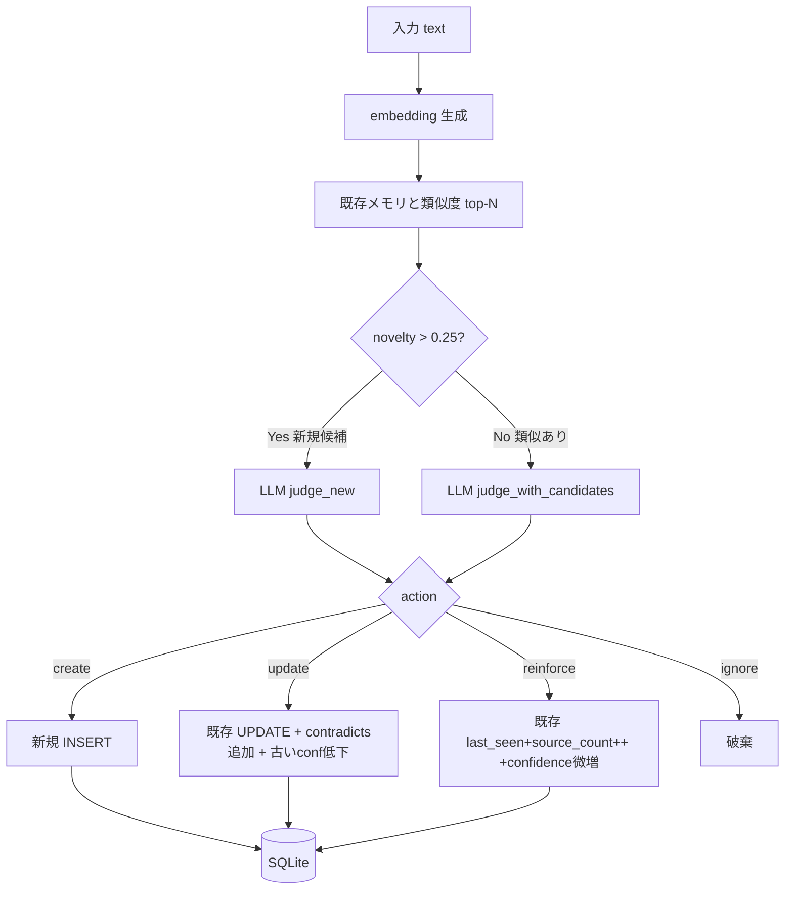

<div align="center">

# diff-memory

### ローカルLLMで「新規性のある情報だけ」を残す差分メモリ層

[](#インストール)
[](diff_memory/db.py)
[](#インストール)
[](LICENSE)

**同じ話を繰り返しても1件にまとまる。矛盾は履歴で残る。判定はあなたのローカルLLMが下す。**

---

</div>

## 概要

通常のRAG（全文保存）ではなく、入力ごとに「新規か / 既存を更新か / 同じ繰り返しで補強か / 無視か」をローカルLLMに判定させ、本当に意味がある情報だけを SQLite に蓄積するメモリ層。

「同じ話の繰り返し」「過去発言の更新・矛盾」「保存価値のない雑談」を分けて扱うため、長期運用しても記憶が雪だるま式に増えず、検索時に古い情報と新情報が並んで返る事故も起きにくい。

完全ローカル動作、依存4個、SQLite 1ファイル運用。

## 普通の RAG との違い

```text
普通の RAG:
  発話や文書を chunk 化して保存し、後で類似検索する。
  → 同じ話の繰り返し・古い情報・矛盾する情報が並んで返ってくる。
  → ストレージは線形に増え、検索ノイズが累積する。

diff-memory:
  入力ごとに「新規 / 更新 / 補強 / 無視」を LLM が判定し、
  記憶を「増やす」のではなく「編集」する。
  → 同じ話は1件にまとまり (reinforce)、古い情報は履歴として残しつつ
     新情報で上書き (update)、雑談は ignore で捨てる。
  → 長期運用してもレコード数が緩やかにしか増えない。
```

| 観点 | 普通の RAG | diff-memory |
|---|---|---|
| 保存判定 | 全部入れる | LLM が `create / update / reinforce / ignore` を選ぶ |
| 重複耐性 | 弱い (同じ話を別レコードで返す) | 同内容は `reinforce` で1件にまとまる |
| 矛盾耐性 | 古い情報と新情報が並列で返る | `update` で本文上書き、旧情報は `confidence` 低下で履歴保持 |
| ストレージ | 線形に増える | 新規性のあるものだけ保存 → 緩やかにしか増えない |
| 時間減衰 | なし (TTL は手動) | `type` 別 `tau` で `importance *= exp(-Δt/τ)` |
| 履歴追跡 | なし | `source_log` テーブルにすべての create/update/reinforce を記録 |
| 検索ランキング | 類似度のみ | `sim + importance + stability + recency + confidence` の加重和 |
| LLM コスト | 検索時のみ | 保存時にも判定 LLM 1回 (1〜30秒) |

→ チャットボットの会話履歴・個人アシスタントのユーザ知識・繰り返し言及される話題の蓄積に向く。一発のドキュメント検索なら通常の RAG の方がオーバーヘッド少ない。

## 特徴

| 項目 | 内容 |
|---|---|
| 判定アクション | `create` / `update` / `reinforce` / `ignore` の4種 |
| 新規性スコア | `novelty = 1 - max_cosine_similarity` (閾値0.25) |
| 検索スコア | `sim*0.45 + importance*0.25 + stability*0.15 + recency*0.10 + confidence*0.05` |
| 矛盾の扱い | 古い記憶を消さず `confidence` を下げて履歴保持 (`contradicts_ids`) |
| 重複の扱い | 同内容の再言及は `reinforce` で `source_count++` のみ (本文書換えなし) |
| 時間減衰 | `type` 別 `tau` で `importance *= exp(-Δt / τ)`<br>(episodic 14日 / project 60日 / fact 180日 / preference・constraint 365日) |
| 履歴 | `source_log` テーブルに全アクション (どの発話で create/update/reinforce されたか) を記録 |
| LLM | Ollama 経由のローカルモデル (`qwen3:4b`, `bge-m3` 等で動作確認) |
| Embedding | sentence-transformers (multilingual-e5-small デフォ) または Ollama (`bge-m3`) |
| ストレージ | SQLite 1ファイル、numpy ブルートフォースコサイン (~数万件まで実用) |

## 処理フロー



## インストール

### 必要なもの

- Python 3.11 以上
- [Ollama](https://ollama.com/) (ローカルでも別マシンでも可、`qwen3:4b` 等の小型モデルで判定）

### セットアップ

```bash
git clone https://github.com/cUDGk/diff-memory.git
cd diff-memory
python -m venv .venv
.venv/Scripts/activate           # Windows
# source .venv/bin/activate      # Linux/macOS
pip install -r requirements.txt

# 軽量な判定モデルを Ollama に入れる
ollama pull qwen3:4b
```

### 設定 (環境変数、すべてデフォルトあり)

| 変数 | デフォルト | 説明 |
|---|---|---|
| `DIFF_MEM_DB` | `memory.db` | SQLite ファイルのパス |
| `DIFF_MEM_OLLAMA_URL` | `http://localhost:11434` | Ollama エンドポイント |
| `DIFF_MEM_MODEL` | `qwen3:4b` | 判定 LLM |
| `DIFF_MEM_EMBED_BACKEND` | `sentence-transformers` | `ollama` も可 |
| `DIFF_MEM_EMBED_MODEL` | `intfloat/multilingual-e5-small` | embed モデル |
| `DIFF_MEM_NOVELTY` | `0.25` | 新規判定の閾値 |
| `DIFF_MEM_KEEP_ALIVE` | `5m` | Ollama の keep_alive |
| `DIFF_MEM_LLM_TIMEOUT` | `600` | LLM コールの timeout 秒 |

## 使い方

```bash
# 設定確認 + Ollama 到達確認
python -m diff_memory doctor

# 発話を入れる (LLM が judge → create/update/reinforce/ignore を選ぶ)
python -m diff_memory add "Windows環境でPythonとNode.jsを開発に使っている"

# 上位K件の関連記憶を取得
python -m diff_memory query "プログラミング言語" -k 5

# プロンプト注入用テキストを stdout に出す
python -m diff_memory inject "今日の作業" -k 3

# 全記憶を簡易リスト表示 (--type で絞り込み)
python -m diff_memory list

# 1件の詳細 + source_log
python -m diff_memory show mem_xxxxxxxxxxxx

# 時間減衰を適用 (cron で回す等)
python -m diff_memory decay
```

### 動作デモ (実際の出力)

#### create / reinforce / update が判定される様子

```bash
$ python -m diff_memory add "Windows環境でPythonとNode.jsを開発に使っている"
{
  "action": "create",
  "memory_id": "mem_92b8196bc668",
  "novelty": 1.0,
  "type": "fact",
  "text": "Windows環境でPythonとNode.jsを開発に使っている",
  "importance": 0.7,
  "stability": 0.8,
  "confidence": 0.9,
  "reason": "開発環境と使用言語という客観的な事実"
}

$ python -m diff_memory add "Pythonでよくコード書いてる"
{
  "action": "reinforce",
  "memory_id": "mem_92b8196bc668",
  "novelty": 0.087,
  "reason": "新発話は既存のfactを補足するためreinforce"
}
# → 既存記憶に統合、source_count++ で別レコードは作らない

$ python -m diff_memory add "今はNode.jsよりDeno使ってる"
{
  "action": "update",
  "memory_id": "mem_92b8196bc668",
  "novelty": 0.071,
  "text": "Denoを用いる開発環境を設定している",
  "reason": "Node.jsからDenoへの移行を反映"
}
# → 本文を更新、旧記述は contradicts と source_log に履歴として残る

$ python -m diff_memory add "おはよう"
{
  "action": "ignore",
  "reason": "新発話は単なる挨拶で保存価値なし"
}
# → 何も保存しない
```

#### query: 加重スコアで上位 K 件

```bash
$ python -m diff_memory query "プログラミング" -k 2
[
  {
    "id": "mem_92b8196bc668",
    "type": "fact",
    "text": "Denoを用いる開発環境を設定している",
    "score": 0.865,
    "sim": 0.812,
    "recency": 1.0,
    "importance": 0.85,
    "stability": 0.92,
    "confidence": 0.98,
    "source_count": 3
  },
  ...
]
```

### Python から直接

```python
from diff_memory.config import Config
from diff_memory.memory import MemoryStore

store = MemoryStore(Config())

res = store.add("差分記憶エンジンを実装中")
# AddResult(action='create', memory_id='mem_xxx', novelty=1.0, judgment=Judgment(...))

results = store.query("プログラミング", k=5)
# [ScoredMemory(memory=Memory(...), score=0.83, similarity=0.84, recency=1.0), ...]

prompt_text = store.render_for_prompt("作業の進捗", k=5)
# "# 関連する記憶\n- [project] ...\n- [fact] ...\n"

n = store.decay()  # type 別 τ で importance を減衰
```

## 検証

### 単体テスト (LLM 不要、~2 秒で完走)

`tests/` 配下に DB 層・embedding ユーティリティ・MemoryStore 本体の単体テストを stdlib `unittest` で配置。Embedder と Judge をスタブ化して LLM/ネットワーク無しで回る。

```bash
$ python -m unittest discover -s tests -v
test_delete_removes_memory_and_history ... ok
test_insert_and_get_roundtrip ... ok
test_invalid_type_rejected_by_check_constraint ... ok
test_lower_confidence_caps_at_zero ... ok
test_reinforce_increments_count_and_confidence ... ok
test_update_text_replaces_content_and_appends_contradicts ... ok
test_ranking_order_preserved ... ok
test_first_add_is_always_create_with_novelty_one ... ok
test_reinforce_increments_source_count_no_duplicate_record ... ok
test_update_overwrites_text_and_records_contradicts ... ok
test_empty_text_is_ignored_without_calling_llm ... ok
test_query_returns_top_k_in_descending_score ... ok
test_decay_reduces_importance_over_time ... ok
test_decay_preserves_high_stability_preference ... ok
... (23 tests total)
----------------------------------------------------------------------
Ran 23 tests in 2.104s

OK
```

### 判定品質評価 (`tools/evals.py`、33 ケース、要 Ollama)

`create / update / reinforce / ignore` の各パスと `preference / fact / project / constraint / episodic` の type 判別を網羅した 33 ケースで判定品質を測る。各ケースは独立 DB で `setup → target` を実行し、期待 action / 期待 type と一致するかを集計する。

```bash
$ python tools/evals.py
# 33 ケース、minipc 経由 qwen36-claude:fixed で実測
======================================================================
  action  : 33/33 = 100.0%
  type    : 33/33 = 100.0%
  errors  : 0
  total   : 868.3s (26.3s/case avg)
======================================================================
```

ベースラインは action 32/33 (97%)、`ignore` 基準と `project` 定義をプロンプトでチューニングして round1 で 100%/100% に到達 (詳細はコミット `90310c5`)。

### 統合テスト (`tools/stress_test.py`、要 Ollama)

embedder cold load を1回に圧縮した 13 ステップのスモークテスト。

```bash
$ python tools/stress_test.py
# embed: sentence-transformers / intfloat/multilingual-e5-small
# llm  : qwen36-claude:fixed @ http://...:11434
# store ready in 15.9s

[PASS] create:tech-fact          ( 28.2s)  create
[PASS] reinforce:same            ( 14.6s)  update
[PASS] update:contradict         ( 13.4s)  update
[PASS] create:unrelated          ( 11.0s)  create
[PASS] ignore:greeting           ( 11.3s)  create
[PASS] create:another-domain     ( 14.2s)  create
[PASS] reinforce:second-hit      ( 14.0s)  create
[PASS] query:tech                (  0.0s)  top=[fact] ...
[PASS] query:hobby               (  0.0s)  top=[preference] ...
[PASS] query:server              (  0.0s)  ...
[PASS] query:vague               (  0.0s)  ...
[PASS] decay                     (  0.0s)  touched 0
[PASS] inject:prompt             (  0.0s)  # 関連する記憶 ...

  RESULT: 13 pass / 0 fail
```

## エディタ統合用フックスクリプト

stdin に JSON、stdout を補助コンテキストとして扱うフック対応 CLI 向けに、入力プロンプトに記憶を注入したり、ターン終了時に発話を捕捉して `add` するスクリプトを `tools/` に同梱。

| スクリプト | 用途 |
|---|---|
| `tools/cc_inject.py` | プロンプト送信前: 関連する過去記憶を `<diff-memory>...</diff-memory>` で挿入 |
| `tools/cc_capture.py` | 応答終了後: transcript の末尾 user 発話を `add` |
| `tools/stress_test.py` | 統合テスト (7 add + 4 query + decay + inject = 13 step) |

## ライセンス

[MIT License](LICENSE)
